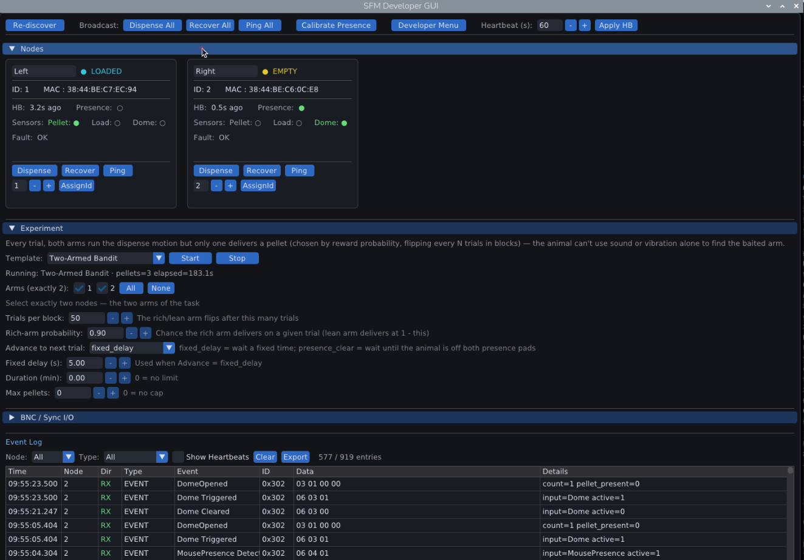

# SFM Developer GUI

Python desktop application (DearPyGui) for the **Spatial Foraging Module (SFM)** —
a base station plus multiple **VFM** nodes — over the CAN bus on a Raspberry Pi 5.



## Requirements

- Raspberry Pi 5 with the station HAT (`can0`)
- Python 3.9+
- Monitor attached (or Raspberry Pi Remote for headless access)

## First-time hardware bring-up

Before running the GUI against real hardware, configure the CAN
controller device tree overlay and bring up `can0`. This only needs to be
done once per Pi:

```bash
cd tools/dev_gui/deploy
sudo ./setup-can.sh            # reboots automatically if needed
sudo ./setup-can.sh --verify   # confirm can0 is healthy after reboot
```

See [deploy/README.md](deploy/README.md) for the manual steps and
troubleshooting if `--verify` reports a failure.

## Install

```bash
cd tools/dev_gui
pip install -r requirements.txt --break-system-packages
```

## Run

```bash
cd tools/dev_gui

# Real hardware (can0) — GUI:
python run.py

# Behavior report from session CSVs (interactive session picker):
python run_report.py

# Virtual CAN for testing (no hardware needed):
sudo modprobe vcan
sudo ip link add dev vcan0 type vcan
sudo ip link set up vcan0

# Terminal 1 — simulate 3 nodes:
python node_simulator.py --interface vcan0 --nodes 3

# Terminal 2 — start GUI:
python run.py --interface vcan0 --nodes 3
```

For `run_report.py` options (list sessions, combine cohorts, date filters, designs,
and more), see [Behavior reports](#behavior-reports-session-csv--printable-html).

Timings and parameter defaults used by the GUI, experiments, and reports:
[docs/BASE_STATION_HARDCODED_VALUES.md](../../docs/BASE_STATION_HARDCODED_VALUES.md).

## CLI options

```
python run.py --help

  --interface, -i  SocketCAN interface name  (default: can0)
  --bitrate,   -b  CAN bitrate in bps        (default: 250000)
  --nodes,     -n  Number of expected nodes  (default: 2)
  --log-dir        Directory for CSV logs    (default: ~/sfm_logs)
```

All CLI arguments pre-fill the setup screen; you can still edit them before clicking **Start Session**.

## Node simulator options

Bring up `vcan0` first (required once per boot; does not persist across reboots):

```bash
sudo modprobe vcan
sudo ip link add dev vcan0 type vcan
sudo ip link set up vcan0
```

```
python node_simulator.py --help

  --interface, -i  SocketCAN interface       (default: vcan0)
  --nodes,     -n  Number of nodes           (default: 3)
  --fault-rate     Fault probability 0.0–1.0 (default: 0.0)
  --skip-discovery Use REJOIN instead of ANNOUNCE
```

## Tests

Base-station tests (GUI, CAN, experiments, discovery, node registry) and
report/analysis tests are two separate suites now that reporting lives in
its own package (see [Behavior reports](#behavior-reports-session-csv--printable-html)):

```bash
# Base station
cd tools/dev_gui
pip install -r requirements.txt   # includes -e ../../packages/sfm-analysis
python -m pytest tests/ -v

# Report / analysis SDK
cd packages/sfm-analysis   # from the repo root
pip install -e ".[dev]"
pytest
```

## Experiment engine (headless task/session API)

The GUI is for live monitoring and discovery. Behavioral tasks live in a
separate **event-driven experiment engine** under
[`base_station/experiment/`](base_station/experiment/). Nodes stay dumb (commands in,
events out); your script decides what to do next.

### Quick start — free feeding against the simulator

```bash
# Terminal 1 — fake nodes (Linux / Pi; needs vcan0 — see above)
python node_simulator.py --interface vcan0 --nodes 3 --skip-discovery

# Terminal 2 — run the built-in free-feeding template for 60 s
python run_experiment.py free_feeding --interface vcan0 --nodes 1,2,3 \
    --seconds 60 --reload-delay 2 --no-io --log-dir ~/sfm_logs
```

On a non-Pi host use `--no-io` so GPIO/BNC setup is skipped.

### Write your own experiment

```python
from base_station.experiment import Experiment, EventKind

exp = Experiment(nodes=[1, 2, 3], name="my_task")

@exp.on_start
def start(control):
    for n in control.nodes:
        control.dispense(n)

@exp.on_pellet_taken
def reload(control, event):
    control.after(2.0, lambda: control.dispense(event.node_id))

exp.end_after(hours=12)
# exp.run(interface="vcan0")   # or: save as my_task.py and use the CLI
```

```bash
python run_experiment.py my_task.py --interface vcan0 --no-io
```

A script may expose either `exp = Experiment(...)` or
`def build(**kwargs) -> Experiment`.

### Built-in templates

| Name | Module | Behavior |
|------|--------|----------|
| `free_feeding` | `base_station.experiment.templates.free_feeding` | Dispense on all nodes at start; after each pellet taken, wait (`fixed_delay` or `presence_clear`) and re-dispense; end on duration and/or pellet cap |
| `fixed_and_random` | `base_station.experiment.templates.fixed_and_random` | Per-node role (off/fixed/random); advance by fixed delay, presence-clear, or BNC |
| `probability_delivery` | `base_station.experiment.templates.probability_delivery` | Each cycle delivers on one node, chosen by weighted random draw; same shared advance |
| `two_armed_bandit` | `base_station.experiment.templates.two_armed_bandit` | Two-armed bandit: both arms move each trial, only one delivers, reward probability flips every `block_size` trials |

### API surface

- **Events** (`EventKind`): `ON_PLATE`, `LOADED`, `PELLET_TAKEN`,
  `FAULT`, phase events, `PRESENCE_CHANGED`, `PG_CHANGED`, plus derived
  `DOME_OPENED` / `DOME_CLOSED`, `NODE_ONLINE` / `NODE_OFFLINE`, and
  base-station `BNC_IN`, `SESSION_START`, `SESSION_END`.
- **Control actions**: `dispense` (pass `feed=False` for a no-pellet motion-only
  cycle), `recover`, `broadcast_dispense`, `broadcast_recover`, `bnc_pulse`,
  `set_heartbeat_interval`, `after` / `every` timers, named `counter` / `incr`, `log`.
- **Sequential tasks**: `@exp.script` — see `base_station/experiment/README.md` §5.
- **Lifecycle**: `start_when(condition)`, `end_after(hours=…, pellets=…)`,
  `end_when(condition)`.
- **Hosting**: `exp.run(interface=…)` (blocking) or
  `runner = exp.make_runner(…); runner.step(now)` for GUI integration later.

Experiment-level CSV logs go to `--log-dir` as
`experiment_<name>_YYYYMMDD_HHMMSS.csv` (separate from the raw-CAN session log).

## Behavior reports (session CSV → printable HTML)

`run_report.py` turns one or more session CSVs into a self-contained,
printable HTML behavior report — no server, no JavaScript, no external
dependencies beyond the standard library. Charts are inline SVG; print
with Ctrl+P / Cmd+P.

The report generator itself lives in a separate, cross-platform package —
[`packages/sfm-analysis`](../../packages/sfm-analysis/README.md), installable
on its own with `pip install sfm-analysis` on any OS. `run_report.py`
below is a thin wrapper around its `sfm-report` CLI that additionally
plugs in this base station's own log-directory auto-detection (external
drive, else `~/sfm_logs`); see `packages/sfm-analysis/README.md` for the
Python API, the report design/section architecture in full, and the five
things to know before trusting a number computed from a session log.

```bash
# List sessions found on the storage drive (or ~/sfm_logs as a fallback):
python run_report.py --list

# One session, opened in the default browser when done:
python run_report.py EXP-Test-02 --open

# Every session for a cohort, combined into one comparative report:
python run_report.py "cohortA_*" --combine -o /tmp/cohortA.html
python run_report.py --all --since 2026-08-01 --combine

# Check how session names parse into subject/cohort/day (see naming.py):
python run_report.py --check-names
```

```
python run_report.py --help

  target...        Session name, shell glob, or path to a .csv (repeatable)
  --log-dir         Default: auto-detected external drive / ~/sfm_logs
  --list            List discovered sessions and exit
  --list-designs    List report designs and exit
  --check-names     Show how each session name parses and exit
  --combine         One comparative report over all targets
  --all             Every session in --log-dir
  --demo            Render the bundled demo session (no rig or log dir needed)
  --since, --until  Filter by date (YYYY-MM-DD)
  --run             Only this run_id (a file can hold several)
  --design          Force a report design instead of resolving by experiment
  --align           Combined-report time alignment: relative | wall | trial | event:<name>
  --out, -o         Output file (single report) or directory (multiple)
  --open            Open the result in your default browser when done
```

**How it's structured** (mirrors the experiment engine's own
JSON-schema/Python split): a report **design** —
[`report/designs/<name>.json`](../../packages/sfm-analysis/src/sfm_analysis/report/designs/)
— declares which **sections** to render and in what order; sections are
plain Python functions registered under
[`report/sections/`](../../packages/sfm-analysis/src/sfm_analysis/report/sections/).
The design is picked automatically from the session's `experiment` field
(`session_start`'s `fields_json`), falling back to `default.json` for
anything without a matching design or with no `session_start` at all.
Metrics (retrieval latency, presence bouts, dispense cycles, bandit
choice/WSLS/reversal, …) live in
[`report/analyses/`](../../packages/sfm-analysis/src/sfm_analysis/report/analyses/)
and
[`report/metrics.py`](../../packages/sfm-analysis/src/sfm_analysis/report/metrics.py),
separately from the HTML that renders them, so the numbers themselves are
testable without parsing HTML.

Add a new comparative view or per-experiment section by writing a
function returning a `SectionResult` and adding its `module.function` ref
to the relevant `report/designs/*.json` — no changes to `run_report.py`
or the render pipeline needed. See
[packages/sfm-analysis/README.md](../../packages/sfm-analysis/README.md)
for the full picture, including the Python API for custom analysis.

## Base station I/O (BNC, AEO, button)

The main screen includes a **BNC / Sync I/O** panel between the node grid and
the event log:

- **BNC IN 1 / BNC IN 2** — configurable label, edge (rising/falling/both),
  and a free-text "action" placeholder. A handful of convenience keywords
  (`dispense_all`, `recover_all`, `ping_all`, `reqstatus_all`) are dispatched
  automatically when enabled; any other value is just logged, ready to be
  wired to real behaviour later.
- **BNC OUT** — configurable label, pulse width (microseconds), and a
  free-text "trigger" placeholder matched against incoming CAN event names
  (or `any_event` to match all events). A "Manual Pulse" button fires a
  one-shot pulse for bench testing regardless of the enable state.

All GPIO for BNC I/O, the user button, and AEO (daisy-chain discovery enable)
is centralized in [base_station/io_manager.py](base_station/io_manager.py). It degrades
to a harmless simulation mode automatically when no GPIO backend
(`gpiod`/`RPi.GPIO`) or hardware is available — e.g. when developing against
`vcan0` on a non-Pi machine.

## File structure

```
tools/dev_gui/
├── requirements.txt           # dearpygui, python-can, RPi.GPIO, gpiod,
│                               # and -e ../../packages/sfm-analysis
├── run.py                    # GUI entry point
├── run_experiment.py         # Headless experiment CLI
├── run_report.py             # Thin wrapper around sfm_analysis.cli.report
│                              # (see packages/sfm-analysis/ below)
├── node_simulator.py         # Fake VFM nodes for vcan0 testing
├── deploy/                   # One-time Pi setup: MCP2515 device tree overlay,
│                              # systemd-networkd unit — see deploy/README.md
├── tests/
│   ├── test_hat.py           # Interactive hardware validation (not pytest)
│   ├── test_run_report_shim.py  # Covers only the run_report.py wrapper itself
│   └── test_*.py             # Automated unit tests (pytest)
├── base_station/
    ├── protocol.py           # Re-export shim -> sfm_analysis.protocol
    ├── can_manager.py        # SocketCAN wrapper (threaded RX)
    ├── io_manager.py         # BNC I/O, button, AEO GPIO (non-CAN)
    ├── discovery_manager.py  # ANNOUNCE/ASSIGN/REJOIN via IOManager.drive_aeo()
    ├── mac_id_registry.py    # Persistent MAC ↔ Node ID dictionary (~/.sfm/…)
    ├── node_registry.py      # Per-node live state (session)
    ├── log_manager.py        # Ring buffer + CSV auto-save (schema from sfm_analysis.logs)
    ├── storage.py            # Writer-side log-dir resolution (headless-safe; no dearpygui import)
    ├── app.py                # DearPyGui screens + render loop
    └── experiment/           # Headless event-driven task engine
        ├── events.py         # EventKind + CAN → NodeEvent normalizer
        ├── context.py        # ExperimentControl: actions, timers, counters, experiment CSV
        ├── script.py         # @exp.script sequential-generator scheduler
        ├── runner.py         # Experiment API + tick loop
        ├── kit.py            # Shared template boilerplate (session/trigger/fault logging)
        └── templates/
            ├── free_feeding.py
            ├── fixed_and_random.py
            ├── probability_delivery.py
            └── two_armed_bandit.py
```

The behavior-report generator itself — `report/`, its `designs/*.json`,
`protocol.py`, and `logs.py` — moved to
[`packages/sfm-analysis/`](../../packages/sfm-analysis/README.md), a
separate, cross-platform, independently pip-installable package; see its
README for that tree and the Python API.

## Persistent MAC ↔ Node ID map

The base station keeps a dictionary of discovered modules in
`~/.sfm/mac_id_registry.json` (created automatically):

```json
{
  "version": 1,
  "mappings": {
    "AA:BB:CC:DD:EE:01": 1,
    "AA:BB:CC:DD:EE:02": 2
  }
}
```

- On **ANNOUNCE**, if the MAC is already in the file the same ID is re-assigned;
  otherwise the next free ID is used and written to the file after **ACK**.
- On **REJOIN**, if the node's NVS ID disagrees with the file, the base station
  sends **ASSIGN** with the historical ID so the mapping stays stable.
- **Re-discover** wipes this file (and broadcasts `ClearId` to node NVS), then
  rediscovers and rebuilds the dictionary from scratch.

## CAN frame reference

| Direction      | CAN ID           | Content                        |
|---------------|------------------|-------------------------------|
| base → node   | `0x100 + nodeId` | Command (Dispense, Recover, …)  |
| base → all    | `0x100`          | Broadcast command             |
| node → base   | `0x200 + nodeId` | Periodic heartbeat/status snapshot |
| node → base   | `0x300 + nodeId` | Immediate event (dispense, fault, Pong, input change) |
| node → base   | `0x080`          | ANNOUNCE (first boot)         |
| base → node   | `0x081`          | ASSIGN (node ID assignment)   |
| node → base   | `0x082`          | ACK                           |
| node → base   | `0x083`          | REJOIN (returning node)       |

Broadcast command opcodes include `ClearId` (`0x07`) — the GUI **Re-discover**
button clears `~/.sfm/mac_id_registry.json`, broadcasts ClearId so every node
wipes its NVS ID, then rediscovers and rebuilds the MAC↔ID dictionary.

`InputChanged` event payloads are `[0x06, inputId, active]`, where input IDs
are pellet=`1`, load position=`2`, dome=`3`, and presence=`4`. These events update the GUI
indicators and log immediately; heartbeats remain the periodic recovery
snapshot.

BNC IN/OUT activity is not a CAN frame — it is logged in the event log with
`frame_type="BNC"` for a unified timeline alongside CAN traffic.
